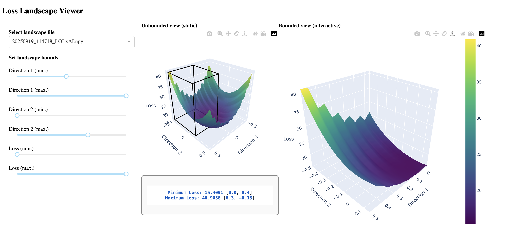

Examples
========

Quick Start
-----------

.. code-block:: python

   import torch
   import torch.nn as nn
   import oxford_loss_landscapes as oll
   from oxford_loss_landscapes.metrics import Loss

   # Define a simple model
   model = nn.Sequential(
       nn.Linear(10, 5),
       nn.ReLU(),
       nn.Linear(5, 1),
   )

   inputs = torch.randn(32, 10)
   targets = torch.randn(32, 1)

   # Wrap the model and define a metric
   model_wrapper = oll.SimpleModelWrapper(model)
   metric = Loss(nn.MSELoss(), inputs, targets)

   # Evaluate loss at current parameters
   loss_value = oll.point(model_wrapper, metric)
   print(f"Current loss: {loss_value:.4f}")

   # Compute a random 2-D loss landscape (25x25 grid)
   landscape = oll.random_plane(model_wrapper, metric, distance=1.0, steps=25)
   print(f"Landscape shape: {landscape.shape}")  # (25, 25)

Linear Interpolation
--------------------

Interpolate loss between two checkpoints:

.. code-block:: python

   import copy

   model_end = copy.deepcopy(model)
   # ... train model_end further ...

   wrapper_start = oll.SimpleModelWrapper(model)
   wrapper_end   = oll.SimpleModelWrapper(model_end)

   line = oll.linear_interpolation(wrapper_start, wrapper_end, metric,
                                   distance=1.0, steps=50)

Parallel Plane Evaluation
--------------------------

Use Ray to evaluate landscape rows in parallel:

.. code-block:: python

   plane = oll.random_plane(
       model_wrapper, metric,
       distance=1.0, steps=25,
       normalization='filter',
       use_ray=True,
       num_workers=4,
   )

Hessian-Aligned Plane
----------------------

Visualise loss in the directions of sharpest curvature:

.. code-block:: python

   criterion = nn.MSELoss()
   loss = criterion(model(inputs), targets)

   plane = oll.hessian_plane(model_wrapper, metric, loss=loss,
                             steps=15, distance=0.5)

Hessian Eigenvalues - Classical Solver
---------------------------------------

.. code-block:: python

   from oxford_loss_landscapes.hessian import min_max_hessian_eigs

   max_eig, min_eig, max_vec, min_vec, iters = min_max_hessian_eigs(
       net=model,
       inputs=inputs,
       outputs=targets,
       criterion=nn.MSELoss(),
   )
   print(f"max eigenvalue = {max_eig:.4f},  min eigenvalue = {min_eig:.4f}")

Hessian Eigenvalues - VR-PCA Solver
-------------------------------------

The VR-PCA solver is more memory-efficient for large models:

.. code-block:: python

   import oxford_loss_landscapes as oll

   config = oll.VRPCAConfig(batch_size=64, epochs=20, tol=1e-4)

   # Largest eigenpair
   result = oll.top_hessian_eigenpair_vrpca(
       net=model, inputs=inputs, targets=targets,
       criterion=nn.MSELoss(), config=config,
   )
   print(f"max eigenvalue ~ {result.eigenvalue:.4f}  (converged={result.converged})")

   # Smallest eigenpair
   min_result = oll.min_hessian_eigenpair_vrpca(
       net=model, inputs=inputs, targets=targets,
       criterion=nn.MSELoss(), config=config,
   )
   print(f"min eigenvalue ~ {min_result.eigenvalue:.4f}")

Hessian Trace
-------------

.. code-block:: python

   from oxford_loss_landscapes.hessian import hessian_trace

   trace = hessian_trace(model, nn.MSELoss(), inputs, targets,
                         num_random_vectors=10)
   print(f"Hessian trace ~ {trace:.4f}")

Dashboard Example
-----------------

Generate an export then launch the interactive Dash dashboard.

**Step 1 - generate the plane with export:**

.. code-block:: python

   plane_losses = oll.random_plane(
       model_wrapper, metric,
       distance=1.0, steps=21,
       normalization='model',
       export=True,
   )

This writes a ``.npy`` file and a ``.toml`` config into a ``results/``
directory in the current working directory.

.. note::

   When ``export=True``, ``random_plane`` returns ``None`` instead of an
   array -- results are written to disk for use with the dashboard.

**Step 2 - launch the dashboard:**

.. code-block:: bash

   python -m oxford_loss_landscapes.dashboard.gui_loss_dash

Typical output::

   Dash is running on http://127.0.0.1:8097/

**Step 3 - explore:**

The dashboard provides zoom, pan, orbital and turntable rotation,
PNG download, and bounded/unbounded view modes.

   Interactive dashboard for a CNN loss landscape.
